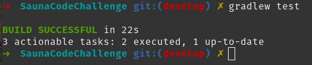
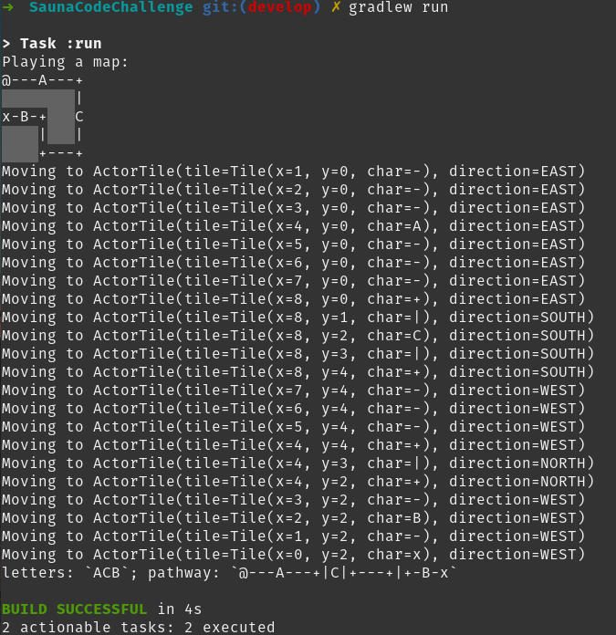
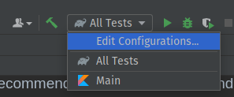
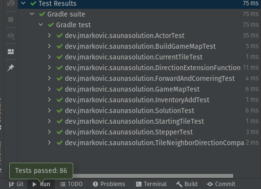

# [Software Sauna](https://www.softwaresauna.com/) solution

Author: Josip Markovic

## Setup and how to run

The project uses Gradle Build System to assemble and run the solution.
I wrote the project using IntelliJ Community (the latest version)
and recommend it for task execution and code review.

Regardless, the project can be executed in one of the two ways:
through **IntelliJ Community** or with **Gradle Tasks in your terminal
of choice**.

### Gradle Tasks

The text assumes you have `gradlew` alias set to the local `gradlew` or
`gradlew.bat` execution file. Global Gradle versions are supported, but
working with the local one is highly recommended.

To run all tests, execute `gradlew test`:



To run the application, execute `gradlew run`



### Using IntelliJ Community

I have created two run configurations, one for tests called `All Tests`,
and one for the application called `Main`.

Both should be available in the projects _Run Configuration_ selection
box.



Running any of the configuration should have the same result as running
them from a terminal, with the added visual effect for tests.



## Modifying the input and the runtime

You can create or paste a map in the
[main.kt](src/main/kotlin/dev/jmarkovic/saunasolution/main.kt) file,
in the `main` function.

```kotlin
fun main() {
  // When pasting, make sure the map is properly aligned. Do not worry
  // about the extra spacing on the left side of the map - the `trimIndent`
  // function removes it.
  val input = """
  @---A---+
          |
  x-B-+   C
      |   |
      +---+
  """.trimIndent()
  
  // ...
}
```

The application takes only a single map. You cannot paste more
than one map.

You can slow down the runtime to have a more effective map traversal.
To do so, add a `Long` parameter to the `actor.traverse(gameMap)` function
that specifies how long do you want the application to "wait" between
each step. You can find the function inside the `play` function in
the `main.kt` file.

```kotlin
fun play(input: String): Inventory {
  val gameMap = buildGameMap(input)
  val actor = buildActor()

//  return actor.traverse(gameMap)
  return actor.traverse(gameMap, delayEachStepMs = 150L)
}
```

Keep in mind this may also affect _some_ tests, so remember to set it
back to 0 or remove the parameter before executing tests.

## Reasoning

The solution can be solved in a single file with only a few classes.
However, to exercise CLEAN and SOLID approach, I wrote the solution
with a strong emphasis on the Single Responsibility Principle.
In other words, (almost) everything that can be defined as a single
`Actionable` is defined as such. I explain the components in the following
few chapters.

### Actor and GameMap

The `Actor` and a `GameMap` are the top level components.

A `GameMap` is the code representation of the game board. It describes
itself with a matrix collection of `Tiles`, and each `Tile` represents
a single `Char` with an `x` and `y` coordinate.

> Since Kotlin doesn't support true 2d arrays, a Matrix is represented
> with the `List<CharArray>` type. This has the same effect as a Matrix
> would have in Java, primarily in how you access values. For example,
> to access the value at position [0, 0], one can use the following
> simple expression: `val tile = board[0][0]`. It is important to note
> that the `y` value comes first. Therefore, for the [1, 2] pair,
> a developer would use the following expression: `val tile = board[2][1]`.

The `Actor` is a "controller" component that takes in a `GameMap` instance
and tries to traverse it from the starting point until the end point,
collecting characters on its way. It 'acts' (does its functionality)
on the map (the object).

Assuming the Actor successfully reaches the end of the map, it returns
an `Inventory` instance, which contains two `String` properties that
represent collected characters. The `Inventory` result is printed
before the application terminates.

### Building a map

The `GameMap` instance must first be constructed from some input
before the `Actor` can run on it.

A top-level factory function in
[MapFactories.kt](src/main/kotlin/dev/jmarkovic/saunasolution/MapFactories.kt)
takes responsibility of building a `GameMap` instance and **running
validation** over the instance before it can be used by the Actor.

The building procedure is simple - the multiline input is first split
into a collection of lines, followed by splitting each line to a
`CharArray` instance.

Once that's done, the function creates a fresh `GameMap` instance, then
runs 4 validation steps:

* it checks that the map contains **a single start tile**;
* it checks that the map contains **a single end tile**;
* it checks that the start tile has a **single neighboring path tile**;
* it checks that the end tile has a **single neighboring end tile**.

If any of the validation steps fail, the function throws a descriptive
error message.

The rest of the code is written with an assumption that the map
passed the validation step. Therefore, no other logic assumes more
than one starting tile and ending tile.

### Traversing and Steps

Before the Actor can start to traverse the map, it needs to know the
location of the starting tile, and a **direction** it needs to go.

The Actor uses `StartingTile` to calculate its starting position.

A `Direction` is an `enum class` that defines 4 directions the Actor
can move.

```kotlin
// documentation in the source code
enum class Direction { NORTH, WEST, SOUTH, EAST }
```

A pair of a `Tile` instance and a `Direction` instance is an
`ActorTile`.

```kotlin
// documentation in the source code
data class ActorTile(val tile: Tile, val direction: Direction)
```

The `Actor` uses `ActorTile`s to know its position and where to go
next. You will notice, however, that the code rarely uses `ActorTile`
type. Instead, the code mostly uses `CurrentTile` and `NextTile`. Both
are _typealiased_ to `ActorTile` and are interchangeable, but give more
clarity to how they are used:

* `CurrentTile` represents the tile and direction this `Actor` currently
stands on and points to;
* `NextTile` is the result of this `Actor` trying to move, based on
what the `CurrentTile` represents (straight lines continue forward,
  corners change direction, etc.).
  
The actual next step is calculated in the `Stepper`. You can imagine
a "stepper" as an Actor that acts on a single step (analogous to the
Actor that acts on the map). The `Stepper` takes in the `CurrentTile`
and the `GameMap` from the Actor, and uses them to calculate the
next step. The result is provided as `NextTile` type.

### Step rules and components

> The actual rules are a bit complex, so the best way to read them
> would be to read the source code in
> [Actions.kt](src/main/kotlin/dev/jmarkovic/saunasolution/Actions.kt)
> file.

Even though the `Stepper` performs the act of stepping on the next tile,
it takes other tools to help it perform. It does so by first identifying
what would be the best action based on what the current `Tile` is
(a letter, a path, a corner, etc.). It then forwards the request to
either `Forward` or `CornerTurn` actionable, who are responsible for
executing the action of going forward or turning a corner.

> An `actionable` is a fancy word for a worker function. It is not
> exclusive to function-oriented programing which I showcase here
> by invoking many functions "from an object". Regardless, they typically
> perform a single operation based on nothing else but the values
> provided in parameters **and/or** values available in the invoking
> object.

In the case of a `Forward` actionable, the function tries to calculate
the `NextTile` that is forward from the `CurrentTile`, relative
to the `CurrentTile.direction`. Similarly, the `CornerTurn` actionable
does the same for the relative left and relative right.

These actionables are the only place in the code after the map builder
where the code executes additional validations.

Assuming the actionables can execute successfully, they calculate the
`NextTile`, which the `Stepper` forwards to the `Actor`.

Finally, the Actor takes the result and stores a copy to its
`Inventory`, then sets it as its `CurrentTile`. It continues like
so until it can no longer move, either by reaching the end of the map
or by encountering an error.

# Conclusion

What I wrote here is a very complex solution for a quite complex task.
It does not cover the whole SOLID principle (it cannot simply because
how small it is), but it does offer a very CLEAN approach almost
completely covered with tests (coverage is sitting at about 85-90%).